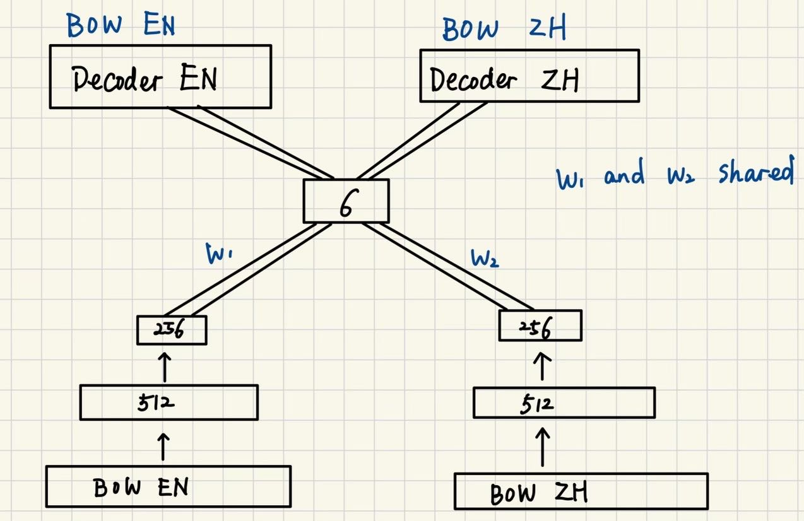

Torch implementation of the generalized topic model.

Paper: Neural Topic Models for the Social Sciences, by Elliott Ash, Germain Gauthier, and Philine Widmer

# Table of Contents

- [Reproduce the Model](#Reproduce)
- [Task 1: Zero Shot](#Task-1-zero-shot-trained-on-one-language-and-test-on-another)
  - [Major Changes](#major-changes)
  - [Reproduce](#reproduce)
  - [Results](#results)
- [Task 2: Embeddings In, Embeddings Out](#task-2-embeddings-in-embeddings-out)
  - [Major Changes](#major-changes-1)
  - [Reproduce](#reproduce-1)
  - [Results](#results-1)
- [Task 3: Separate Decoders](#task-3-separate-decoders)
  - [Major Changes](#major-changes-2)
  - [Reproduce](#reproduce-2)
  - [Results](#results-2)
- [Task 4: Separate Decoders and Encoders](#task-4-separate-decoders-and-encoders)
  - [Major Changes](#major-changes-3)
  - [Reproduce](#reproduce-3)
  - [Results](#results-3)

# Reproduce

For all tasks, download the following zips and unzip in the project root directory.

checkpoints: [ckpt2.zip]() (Coming soon!)

dataset: [data.zip](https://drive.google.com/file/d/1X0EDDpR3xrSVmrf7M0elvxyl4VR5dMYJ/view?usp=drive_link)

Please also download the pkl files below and put into the **notebooks** folder.

[train_dataset_intfloat-e5-large2-en-zh.pkl](https://drive.google.com/file/d/1Mu_1l4AGScU6oRSZu1i-IU5C5fLDpe8y/view?usp=drive_link)

[train_dataset_intfloat-e5-large2-zh.pkl](https://drive.google.com/file/d/1457gr271TWSHiuWT35YNd5IBJTaCmgUm/view?usp=drive_link)

[train_dataset_intfloat-e5-large2-en.pkl](https://drive.google.com/file/d/1Je1A5cZYI7f4lxuLY-Tci16rAWLvIB1K/view?usp=drive_link)

# Task 1: zero shot, trained on one language and test on another

embeddings in, bow out.

## Major changes

**gtm/gtm_customized.py**

Modify to add macos gpu support, otherwise the same as original file.

**gtm/corpus.py**

Add a new field to mark the language of each document. Useful for later tasks.

## Reproduce
Run the ipynb file in **notebooks/gtm_wiki_task1.ipynb** to reproduce the results below.

## Results

New results:

| Training | Testing | F1 Macro       | F1 Micro       | Accuracy       | ARS           |
|----------|---------|----------------|----------------|----------------|---------------|
| EN       | EN      | 97.53%         | 97.56%         | 97.56%         | 94.28%        |
| EN       | ZH      | 58.47%         | 62.25%         | 62.25%         | 32.96%        |
| ZH       | EN      | 63.28%         | 68.14%         | 68.14%         | 41.83%        |
| ZH       | ZH      | 88.37%         | 88.70%         | 88.70%         | 76.80%        |

Previously, we had:

| Training | Testing | F1 Macro       | F1 Micro       | Accuracy       | ARS           |
|----------|---------|----------------|----------------|----------------|---------------|
| EN       | EN      | 97.30%         | 97.35%         | 97.35%         | 93.85%        |
| EN       | ZH      | 55.06%         | 59.80%         | 59.80%         | 31.40%        |
| ZH       | EN      | 47.22%         | 52.47%         | 52.47%         | 25.35%        |
| ZH       | ZH      | 78.96%         | 79.37%         | 79.37%         | 63.49%        |

# Task 2: embeddings in, embeddings out

Train and test on combined English-Chinese data.

## Major changes

**gtm/gtm_customized.py**, same file as in task1.

Modify to add *decoder_output* in the class init function. Options are *bow* or *embeddings*.

## Reproduce
Run the ipynb file in **notebooks/gtm_wiki_task2.ipynb** to reproduce the results below.

## Results

New results:

| Metric    | Value (%)       |
|-----------|-----------------|
| f1_macro  | 45.93%          |
| f1_micro  | 51.73%          |
| acc       | 51.73%          |
| ars       | 36.18%          |

Previously, we had:

| Metric    | Value (%)       |
|-----------|-----------------|
| f1_macro  | 51.33%          |
| f1_micro  | 51.29%          |
| acc       | 51.29%          |
| ars       | 31.70%          |

# Task 3: separate decoders

Train and test on combined English-Chinese data, but English and Chinese have separate decoders, respectively.

embeddings in, bow out.

## Major changes

**gtm/gtm_customized.py**.

a. Modify to a domain of *separate_decoders* in init function.

b. Line 413 to Line 425, modify to accommodate separate decoders, the autoencoder now has two separate decoders, each with its own x_recon, but only one is valid, selected by the data['lang'] field.

**gtm/autoencoder_task3.py**.

Add a separate decoder for each language. During decoding, both decoder is used, and x_recon is selected by the data['lang'] field in *epoch* function of gtm_customized.py.

## Reproduce
Run the ipynb file in **notebooks/gtm_wiki_task3.ipynb** to reproduce the results below.

## Results

New results:

| Metric    | Value (%) |
|-----------|-----------|
| f1_macro  | 45.91%    |
| f1_micro  | 51.70%    |
| acc       | 51.70%    |
| ars       | 36.19%    |

Previously, we had:

| Metric    | Value (%)       |
|-----------|-----------------|
| f1_macro  | 45.80%          |
| f1_micro  | 51.62%          |
| acc       | 51.62%          |
| ars       | 35.51%          |

# Task 4: separate decoders and encoders

Train and test on combined English-Chinese data, but English and Chinese have separate encoders and decoders, they share the same latent space of 6 topics.

gtm_wiki_task4.ipynb: bow in, bow out.
gtm_wiki_task4_2.ipynb: embeddings in, bow out.

## Major changes

**gtm/gtm_customized.py**.

a. Modify to a domain of *separate_encoders* in init function.

b. For separate_encoders option, add condition such that autoencoder is inited from autoencoder3, where each language has its own encoder and decoder, but share the same embedding space (see the Figure below).

Figure of task4 model: 

**gtm/autoencoder_task4.py**.

Add a separate decoder and encoder for each language. During decoding, both decoder is used, and x_recon is selected by the data['lang'] field in *epoch* function of gtm_customized.py.

## Reproduce
1. For bow in, bow out, run the ipynb file in **notebooks/gtm_wiki_task4.ipynb** to reproduce the results below.
2. For embeddings in, bow out, run the ipynb file in **notebooks/gtm_wiki_task4_2.ipynb** to reproduce the results below.

## Results

bow in, bow out:

New:

| Metric    | Value (%) |
|-----------|-----------|
| f1_macro  | 30.90%    |
| f1_micro  | 36.26%    |
| acc       | 36.26%    |
| ars       | 11.47%    |

Old:

| Metric    | Value (%) |
|-----------|-----------|
| f1_macro  | 28.54%    |
| f1_micro  | 36.90%    |
| acc       | 36.90%    |
| ars       | 12.23%    |

embeddings in, bow out (only with new results):

| Metric    | Value (%) |
|-----------|-----------|
| f1_macro  | 29.33%    |
| f1_micro  | 36.31%    |
| acc       | 36.31%    |
| ars       | 7.94%     |
